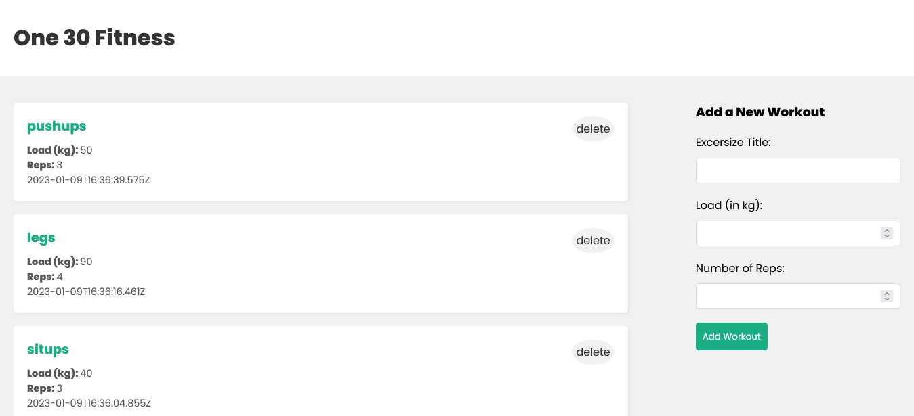

# Mern-JWT-Auth

# Tech Stack

    Reactjs
    Nodejs
    Expressjs
    MongoDB

# Installation

- Clone the repository
- Go to the project directory and run the following commands
- add mongodb url to connect with backend (.env)

`npm install` to install all the dependencies.

`npm run dev` to start the backend 

`npm start` to start frontend concurrently

# img

